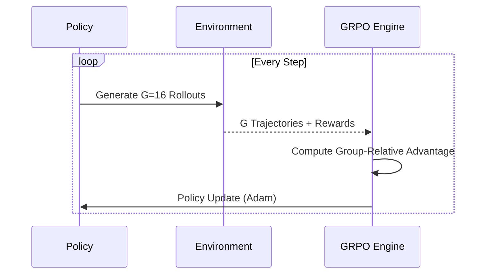

ctrl+<p align="center">
  
</p>

<h1 align="center">Ahab</h1>
<h3 align="center"><em>The Relentless Pursuit of Alpha</em></h3>

<p align="center">
  <strong>A state-of-the-art reinforcement learning (RL) trading agent leveraging Group Relative Policy Optimization (GRPO) — the same innovative algorithm used by DeepSeek-R1 — for multi-asset portfolio management.</strong>
</p>

<p align="center">
  <a href="https://github.com/MorkMindy74/Ahab/actions"></a>
  <a href="https://www.python.org/"></a>
  <a href="https://pytorch.org/"></a>
  <a href="LICENSE"></a>
  <a href="https://github.com/MorkMindy74/Ahab/stargazers"></a>
</p>

<p align="center">
  <a href="#-quick-start">Quick Start</a> • 
  <a href="#-key-innovations">Key Innovations</a> • 
  <a href="#-architecture">Architecture</a> • 
  <a href="#-performance">Performance</a> • 
  <a href="#-configuration">Configuration</a> • 
  <a href="#-contributing">Contributing</a>
</p>

---

> *"I'd strike the sun if it insulted me."* — Captain Ahab, *Moby-Dick*
>
> In the vast ocean of financial markets, Ahab is the relentless hunter. No critic network to second-guess it. No value function to constrain it. Just a single-minded actor, exploring thousands of parallel futures from every market state, learning which actions lead to the greatest catch.

---

## Why Ahab?

Most RL-based portfolio managers rely on **actor-critic** architectures — they need a separate critic network to estimate how good a state is, then use that estimate to train the actor. This is fragile: the critic's errors propagate into the actor's decisions, creating instability in noisy financial data.

**Ahab eliminates the critic entirely.** Instead, it uses [Group Relative Policy Optimization (GRPO)](https://arxiv.org/abs/2402.03300) — an algorithm originally developed for LLM alignment (DeepSeek-R1) — adapted for financial markets. The core insight: *you don't need to estimate absolute value if you can compare relative outcomes.*

From each market state, Ahab launches **16 parallel simulations** with different trading strategies. The ones that perform better than the group average are reinforced; the rest are suppressed. No critic. No value estimation. Just **direct competition between strategies.**

## Key Innovations

| Technical Highlight | Description |
| :--- | :--- |
| **The GRPO Advantage** | Instead of rolling out single trajectories, Ahab generates **G=16 parallel futures** from each market state. This provides a robust, empirically-grounded learning signal through group-relative comparison, reducing bias in volatile markets. |
| **Hybrid CNN-MLP Architecture** | A **3-Channel CNN** processes price history, RSI, and MACD as spatial-temporal patterns, while an **MLP branch** handles portfolio state (VIX, cash, holdings) to ground recognition in reality. |
| **Diverse Asset Universe** | Manages a **30-instrument universe** including top US Equities (AAPL, MSFT) and diversified ETFs (SPY, GLD, TLT), allowing for rotation into safe-havens during downturns. |
| **Risk-Adjusted Rewards** | Ahab is rewarded for maximizing the **Sortino Ratio**, which penalizes only downside volatility, training the agent to seek asymmetric gains. |
| **Automatic Stop-Loss** | If drawdown from peak exceeds **10%**, positions are liquidated immediately. The agent learns to avoid catastrophic losses proactively. |
| **Safe-Harbor Action** | An extra action dimension lets the agent declare **"cash out"** — voluntarily ending an episode when risk is too high. |

## Architecture

```mermaid
graph TD
    A[Market State (Close, RSI, MACD)] --> B[1D-CNN Branch]
    S[Scalar State (VIX, Portfolio)] --> C[MLP Branch]
    B & C --> D[Feature Fusion]
    D --> E[SwiGLU Head]
    E --> F[Portfolio Weights & Safe-Harbor]
```

### Training Flow



Each training cycle accumulates **64 full trajectories** before each policy update, providing a rich, diverse training signal.

## Performance

### 2024 Out-of-Sample (Enhanced Agent)
> **Period:** April 1, 2024 – Dec 31, 2024 (9 months). **Never seen** during training.

| Metric | Ahab Agent | SPY Benchmark |
| :--- | :--- | :--- |
| **Total Return** | **+14.63%** | +13.33% |
| **Max Drawdown** | **-7.90%** | -11.5% |
| **Max Sortino Ratio** | **1.76** | - |
| **Alpha Generation** | **1.30%** | (Over Benchmark) |

> [!NOTE]
> **Data Discrepancy Note:** You may notice the S&P 500 returns for the full year 2024 are higher (24-26%). Ahab's test period covers April to December 2024. The first 60 trading days are utilized as a warm-up window to calculate stable technical indicators (RSI/MACD). The comparison is strictly apples-to-apples.

### Historical Out-of-Sample (2020–2024)
> Trained on 2004–2020. Baseline GRPO.

| Metric | Ahab | S&P 500 |
| :--- | :---: | :---: |
| **Total Return** | **+639.37%** | +85.6% |
| **Annualized Sharpe** | **1.39** | 0.72 |
| **Max Drawdown** | -50.15% | -33.9% |


## Quick Start

### Install
```bash
git clone https://github.com/MorkMindy74/Ahab.git
cd Ahab
pip install -e ".[dev]"
```

### Train
```bash
# Baseline GRPO agent
python train_grpo.py
# Enhanced agent with Sortino reward + stop-loss + VIX
python train_enhanced.py
```

### Evaluate
```bash
# Test baseline agent
python test.py
# Test enhanced agent with SPY benchmark comparison
python test_enhanced.py
```

## Configuration

Ahab uses a clean YAML-based configuration system:

| Config | Training Data | Reward | State Features | Stop-Loss |
| :--- | :--- | :--- | :--- | :--- |
| [`default.yaml`](configs/default.yaml) | 2004–2020 | Terminal return | Close prices | No |
| [`enhanced.yaml`](configs/enhanced.yaml) | 2013–2023 | Sortino ratio | Close+RSI+MACD+VIX | 10% DD |

## Project Structure

```text
ahab/
├── ahab/                    # Core package
│   ├── rl_agent/            # GRPO & Enhanced Agents
│   ├── environment/         # Portfolio & GRPO Envs
│   ├── data/                # Handlers & Indicators
│   └── portfolio/           # Portfolio Management
├── configs/                 # YAML presets
├── test_results/            # Performance plots
├── train_enhanced.py        # Main training entry
└── test_enhanced.py         # Main evaluation entry
```

## Built With
* **PyTorch** – Deep Reinforcement Learning
* **YFinance** – Financial Data Ingestion
* **Custom Ahab Env** – Realistic slippage (0.05%) and commissions (0.1%)
* **GRPO** – Group Relative Policy Optimization

## Citation

```bibtex
@software{ahab2025,
  title = {Ahab: Critic-Free Reinforcement Learning for Portfolio Management with GRPO},
  author = {MorkMindy74 and Priyanshu-5257 and Claude},
  year = {2025},
  url = {https://github.com/MorkMindy74/Ahab}
}
```

## License
[MIT](LICENSE) © 2025 MorkMindy74

Built with obsession. Powered by GRPO. No critics allowed.
