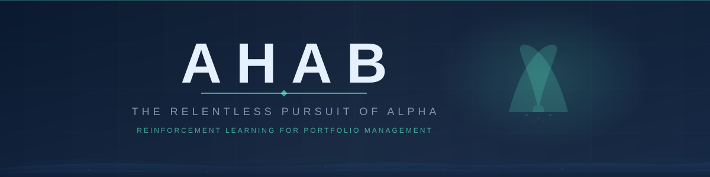
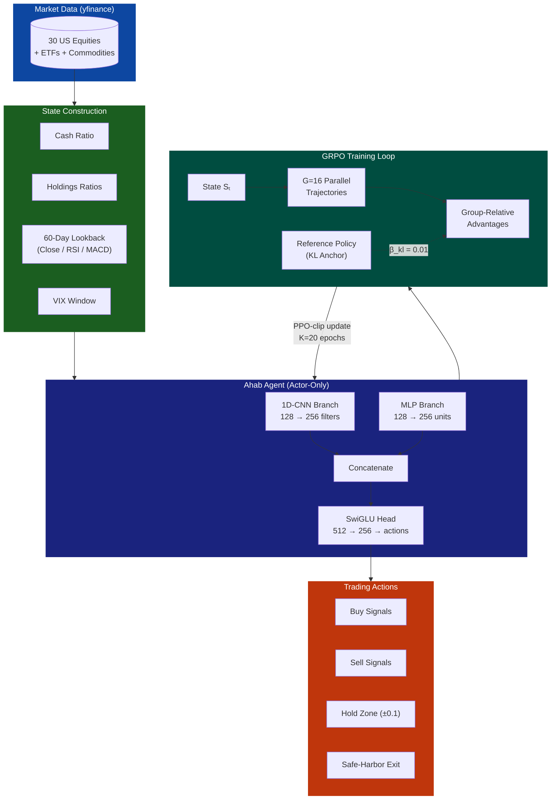
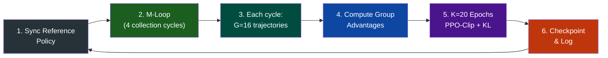

<p align="center">
  
</p>

<h1 align="center">Ahab</h1>
<h3 align="center"><em>The Relentless Pursuit of Alpha</em></h3>

<p align="center">
  <strong>Critic-free reinforcement learning for portfolio management, powered by Group Relative Policy Optimization (GRPO).</strong>
</p>

<p align="center">
  <a href="https://github.com/antigravity-lab/ahab/actions"></a>
  <a href="https://www.python.org/"></a>
  <a href="https://pytorch.org/"></a>
  <a href="LICENSE"></a>
  <a href="https://github.com/antigravity-lab/ahab/stargazers"></a>
</p>

<p align="center">
  <a href="#-quick-start">Quick Start</a> &bull;
  <a href="#-key-innovations">Key Innovations</a> &bull;
  <a href="#-architecture">Architecture</a> &bull;
  <a href="#-performance">Performance</a> &bull;
  <a href="#-configuration">Configuration</a> &bull;
  <a href="#-contributing">Contributing</a>
</p>

---

> *"I'd strike the sun if it insulted me."* — Captain Ahab, *Moby-Dick*
>
> In the vast ocean of financial markets, Ahab is the relentless hunter. No critic network to second-guess it. No value function to constrain it. Just a single-minded actor, exploring thousands of parallel futures from every market state, learning which actions lead to the greatest catch.

---

## Why Ahab?

Most RL-based portfolio managers rely on **actor-critic** architectures — they need a separate critic network to estimate how good a state is, then use that estimate to train the actor. This is fragile: the critic's errors propagate into the actor's decisions, creating instability in noisy financial data.

**Ahab eliminates the critic entirely.** Instead, it uses [Group Relative Policy Optimization (GRPO)](https://arxiv.org/abs/2402.03300) — an algorithm originally developed for LLM alignment — adapted for financial markets. The core insight: *you don't need to estimate absolute value if you can compare relative outcomes.*

From each market state, Ahab launches **16 parallel simulations** with different trading strategies. The ones that perform better than the group average are reinforced; the rest are suppressed. No critic. No value estimation. Just **direct competition between strategies.**

---

## Key Innovations

<table>
<tr>
<td width="50%">

### Single-State, Multi-Path Paradigm
Instead of rolling out single trajectories like PPO, Ahab generates **G=16 parallel futures** from each market state. This provides a robust, empirically-grounded learning signal through group-relative comparison.

### Critic-Free Architecture
An **actor-only** network with zero critic overhead. The learning signal comes entirely from group-relative advantages — no value function approximation errors.

### Hybrid CNN + MLP Network
A **1D-CNN branch** processes 60-day price sequences across all assets, while an **MLP branch** handles portfolio state (cash, holdings). Both feed into a **SwiGLU**-activated head.

</td>
<td width="50%">

### Sortino-Based Reward (Enhanced)
Terminal reward uses the **Sortino ratio** — penalizing downside volatility only — instead of raw returns. This teaches the agent to seek asymmetric risk-adjusted gains.

### Automatic Stop-Loss
If drawdown from peak exceeds **10%**, positions are liquidated immediately with a penalty. The agent learns to avoid catastrophic losses proactively.

### Safe-Harbor Action
An extra action dimension lets the agent declare **"cash out"** — voluntarily ending an episode when risk is too high. The agent learns *when to stop trading*.

### 3-Channel Market Features (Enhanced)
Each asset provides **Close + RSI(14) + MACD** as three input channels, plus a global **VIX window** — giving the agent visibility into momentum, trend, and market fear.

</td>
</tr>
</table>

---

## Architecture



### Training Flow



Each training cycle: **Reference sync → 4 × (advance state + 16 rollouts) → 20 gradient epochs → checkpoint.** This accumulates **64 full trajectories** before each policy update, providing a rich, diverse training signal.

---

## Performance

### Out-of-Sample Results (2020–2024)

> Trained on 2004–2020. **Never saw** this data during training.

| Metric | Ahab | S&P 500 |
|:---|:---:|:---:|
| **Total Return** | **+639.37%** | +85.6% |
| **Annualized Sharpe** | **1.39** | 0.72 |
| **Max Drawdown** | -50.15% | -33.9% |

<p align="center">
  
</p>

### Across Market Regimes

| Period | Context | Return | Sharpe | Max DD |
|:---|:---|:---:|:---:|:---:|
| **2020** | COVID crash + recovery | **+146.36%** | **3.51** | -16.84% |
| **2021–2024** | Mixed bull/bear | **+222.15%** | 1.19 | -40.35% |
| **2022–2024** | Post-bubble recovery | **+111.84%** | 1.11 | -33.62% |
| **2023–2024** | New bull market | **+114.32%** | **2.03** | -16.51% |

### Enhanced Agent (Sortino + Stop-Loss + VIX)

<p align="center">
  
</p>

The enhanced agent adds **risk-aware rewards** (Sortino ratio), **automatic stop-loss** at 10% drawdown, and **3-channel market features** (Close + RSI + MACD + VIX). See [`configs/enhanced.yaml`](configs/enhanced.yaml) for full configuration.

---

## Quick Start

### Install

```bash
git clone https://github.com/antigravity-lab/ahab.git
cd ahab
pip install -e ".[dev]"
```

### Train

```bash
# Baseline GRPO agent (trains on 2004-2020)
python train_grpo.py

# Enhanced agent with Sortino reward + stop-loss + VIX
python train_enhanced.py
```

### Evaluate

```bash
# Test baseline agent (out-of-sample 2024)
python test.py

# Test enhanced agent with SPY benchmark comparison
python test_enhanced.py
```

### Configure

All hyperparameters are defined in YAML:

```yaml
# configs/default.yaml
grpo:
  group_size: 16          # parallel trajectories per state
  collection_cycles: 4    # data collection before training
  update_epochs: 20       # gradient updates per batch
  beta_kl: 0.01           # KL divergence penalty

risk:
  stop_loss_threshold: 0.10   # 10% drawdown → liquidation
```

Load configs programmatically:

```python
from ahab.config import load_config

cfg = load_config("configs/enhanced.yaml")
print(cfg.grpo.group_size)      # 16
print(cfg.risk.stop_loss_threshold)  # 0.10
```

---

## Configuration

Ahab uses a clean YAML-based configuration system. Two presets are included:

| Config | Training Data | Reward | State Features | Stop-Loss |
|:---|:---|:---|:---|:---|
| [`default.yaml`](configs/default.yaml) | 2004–2020 | Terminal return | Close prices | No |
| [`enhanced.yaml`](configs/enhanced.yaml) | 2013–2023 | Sortino ratio | Close + RSI + MACD + VIX | 10% DD |

See [`ahab/config.py`](ahab/config.py) for the full typed dataclass schema.

---

## Project Structure

```
ahab/
├── ahab/                       # Core package
│   ├── config.py               # YAML config loader (typed dataclasses)
│   ├── rl_agent/
│   │   ├── grpo_agent.py       # GRPOAgent — actor-only, SwiGLU, CNN+MLP
│   │   ├── enhanced_grpo_agent.py  # 3-channel CNN (Close/RSI/MACD) + VIX
│   │   ├── environment.py      # Base PortfolioEnv (60-day episodes)
│   │   ├── enhanced_environment.py  # Sortino reward, stop-loss, safe-harbor
│   │   ├── grpo_environment.py      # Single-state multi-path wrapper
│   │   └── enhanced_grpo_environment.py
│   ├── data/
│   │   ├── data_handler.py     # yfinance downloader + cache
│   │   └── enhanced_data_handler.py  # + RSI, MACD, VIX computation
│   ├── portfolio/
│   │   └── portfolio_manager.py    # Holdings, cash, value tracking
│   ├── execution/
│   │   └── execution_handler.py    # Slippage + commission simulation
│   └── assets.txt              # 30-asset universe
├── configs/
│   ├── default.yaml            # Baseline configuration
│   └── enhanced.yaml           # Enhanced mode configuration
├── train_grpo.py               # Training script (baseline)
├── train_enhanced.py           # Training script (enhanced)
├── test.py                     # Evaluation script (baseline)
├── test_enhanced.py            # Evaluation script (enhanced + SPY)
├── tests/                      # Test suite
├── pyproject.toml              # Package definition
└── LICENSE                     # MIT
```

---

## How GRPO Works (vs PPO)

<table>
<tr>
<th></th>
<th>PPO (Actor-Critic)</th>
<th>Ahab/GRPO (Actor-Only)</th>
</tr>
<tr>
<td><strong>Value Estimation</strong></td>
<td>Critic network predicts V(s)</td>
<td>None — advantages from group comparison</td>
</tr>
<tr>
<td><strong>Advantage Calculation</strong></td>
<td>A(s,a) = R - V(s) — error-prone in noisy markets</td>
<td>A_i = (R_i - mean(R_group)) / std(R_group) — empirically grounded</td>
</tr>
<tr>
<td><strong>Trajectories per State</strong></td>
<td>1 (on-policy rollout)</td>
<td>G=16 parallel paths — rich exploration</td>
</tr>
<tr>
<td><strong>Training Stability</strong></td>
<td>Critic errors → actor instability</td>
<td>No critic → no propagation of estimation errors</td>
</tr>
<tr>
<td><strong>Model Complexity</strong></td>
<td>2 networks (actor + critic)</td>
<td>1 network (actor only) — 50% fewer parameters</td>
</tr>
<tr>
<td><strong>KL Regularization</strong></td>
<td>Optional</td>
<td>Built-in reference policy with β_kl = 0.01</td>
</tr>
</table>

---

## Asset Universe

Ahab trades a diversified universe of **30 instruments** spanning equities, sector ETFs, international ETFs, commodities, and fixed income:

<details>
<summary><strong>View full asset list</strong></summary>

| Category | Tickers |
|:---|:---|
| **Tech Mega-Caps** | AAPL, MSFT, GOOGL, AMZN, NVDA, META, TSLA |
| **Blue Chips** | BRK-B, JNJ, PG, JPM, V, UNH |
| **Index ETFs** | SPY, QQQ, DIA, IWM |
| **Sector ETFs** | XLF, XLE, XLV, XLI, XLY, VNQ |
| **International** | EFA, EEM |
| **Commodities** | GLD, SLV, USO |
| **Fixed Income** | TLT, HYG |

</details>

---

## Key Hyperparameters

| Symbol | Name | Value | Purpose |
|:---:|:---|:---:|:---|
| G | Group Size | 16 | Parallel trajectories per state |
| M | Collection Cycles | 4 | States sampled before each update |
| K | Update Epochs | 20 | Gradient steps per training batch |
| β_kl | KL Penalty | 0.01 | Prevents catastrophic policy shifts |
| ε | Clip Range | 0.2 | PPO-style trust region |
| σ₀ | Initial Std | 0.6 | Exploration noise at start |
| lr | Learning Rate | 1e-5 | Conservative for financial stability |

Per training cycle: **M × G = 64 trajectories × 60 steps = 3,840 timesteps** feed into **K = 20 gradient epochs**.

---

## Future Roadmap

- [ ] **Multi-timeframe attention** — add weekly/monthly lookback alongside daily
- [ ] **Transaction cost annealing** — gradually increase costs during training for robustness
- [ ] **Live paper trading** — Alpaca/IBKR integration for forward testing
- [ ] **Ensemble agents** — combine base + enhanced agents for diversified signals
- [ ] **Process supervision** — intermediate Sharpe-based rewards alongside terminal

---

## Citation

If you use Ahab in your research, please cite:

```bibtex
@software{ahab2025,
  title  = {Ahab: Critic-Free Reinforcement Learning for Portfolio Management with GRPO},
  author = {Antigravity Labs},
  year   = {2025},
  url    = {https://github.com/antigravity-lab/ahab}
}
```

---

## Contributing

We welcome contributions! See [CONTRIBUTING.md](CONTRIBUTING.md) for guidelines.

---

## License

[MIT](LICENSE) &copy; 2025 Antigravity Labs

<p align="center">
  <sub>Built with obsession. Powered by GRPO. No critics allowed.</sub>
</p>
